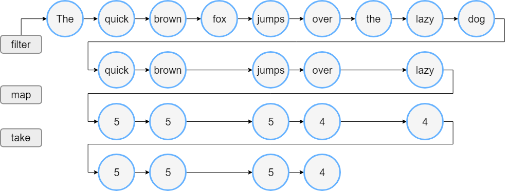
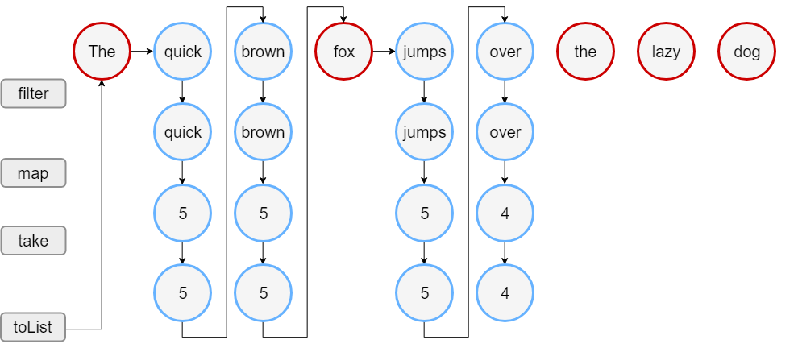

# 시퀀스 \(Sequences\)

Kotlin 표준 라이브러리에서 콜렉션은 다른 컨테이너 타입을 포함합니다 - _시퀀스_ \([`Sequence<T>`](https://kotlinlang.org/api/latest/jvm/stdlib/kotlin.sequences/-sequence/index.html)\). 시퀀스는 [`Iterable`](https://kotlinlang.org/api/latest/jvm/stdlib/kotlin.collections/-iterable/index.html)와 같은 함수를 제공하지만 여러 단계의 콜렉션에 다른 접근을 구현합니다.

`Iterable`이 여러단계에 걸쳐 진행될 때 각 처리단계가 완료되고 중간 콜렉션이라는 결과값을 반환합니다. 콜렉션은 단계별로 실행됩니다. 시퀀스의 여러 단계는 가능한 느리게 실행됩니다: 실질적인 동작은 전체 처리 동작의 결과가 요청된 경우에만 발생합니다.

`Sequence`는 모든 단일 요소에 대해 하나씩 처리합니다. `Iterable`는 각 단계를 완료한 후 다음 단계를 진행합니다.

따라서 시퀀스는 중간 단계의 결과를 작성하지 않아도 되므로 전체 콜렉션 처리 성능이 향상되게 됩니다. 그러나 작은 크기의 콜렉션이나 간단한 계산 동작에 대해서는 오버헤드가 생길 수 있습니다. 그러므로 `Sequence` 와 `Iterable` 중 어떤 것이 더 나은 방법인지 선택해야 합니다.

## 구조 \(Constructing\)

### 요소 \(From elements\)

시퀀스를 만들기 위해 [`sequenceOf()`](https://kotlinlang.org/api/latest/jvm/stdlib/kotlin.sequences/sequence-of.html) 함수에 인자에 리스트 요소를 포함하여 호출합니다.

```kotlin
val numbersSequence = sequenceOf("four", "three", "two", "one")
```

### `Iterable` \(From `Iterable`\)

이미 `Iterable` 객체 \(`List` 또는 `Set`\)를 가지고 있다면 [`asSequence()`](https://kotlinlang.org/api/latest/jvm/stdlib/kotlin.collections/as-sequence.html) 호출을 통해 시퀀스를 만들 수 있습니다.

```kotlin
val numbers = listOf("one", "two", "three", "four")
val numbersSequence = numbers.asSequence()
```

### 함수 \(From function\)

시퀀스를 만드는 또다른 방법은 요소를 계산하는 함수로 만드는 것입니다. 함수를 기반으로 시퀀스를 만드려면 함수를 인자로 사용하여 [`generateSequence()`](https://kotlinlang.org/api/latest/jvm/stdlib/kotlin.sequences/generate-sequence.html)을 호출하면 됩니다. 선택적으로 첫번째 요소를 명시적인 값이나 함수의 결과값으로 할 수 있습니다. 함수가 `null`을 반환하면 시퀀스 생성이 중단됩니다. 아래의 예는 무한한 시퀀스 입니다.

```kotlin
fun main() {
//sampleStart
    val oddNumbers = generateSequence(1) { it + 2 } // `it` is the previous element
    println(oddNumbers.take(5).toList())
    //println(oddNumbers.count())     // error: the sequence is infinite
//sampleEnd
}
```

`generateSequence()`을 이용하여 유한한 시퀀스를 생성하려면 함수가 마지막 요소를 반환한 후에 `null`을 반환하도록 하십시오.

```kotlin
fun main() {
//sampleStart
    val oddNumbersLessThan10 = generateSequence(1) { if (it + 2 < 10) it + 2 else null }
    println(oddNumbersLessThan10.count())
//sampleEnd
}
```

### 청크 \(From chunks\)

마지막으로 시퀀스 요소를 하나씩 또는 임의의 크기의 덩어리로 생성할 수 있는 [`sequence()`](https://kotlinlang.org/api/latest/jvm/stdlib/kotlin.sequences/sequence.html) 함수가 있습니다. 이 함수는 [`yield()`](https://kotlinlang.org/api/latest/jvm/stdlib/kotlin.sequences/-sequence-scope/yield.html) 와 [`yieldAll()`](https://kotlinlang.org/api/latest/jvm/stdlib/kotlin.sequences/-sequence-scope/yield-all.html) 함수의 호출을 포함하는 람다 표현식 입니다. 요소 하나를 반환하면 다음 요소에 대한 요청이 있을 때까지 `sequence()`의 실행은 중단됩니다. `yield()`는 한개의 인자를 가지고 `yieldAll()`은 `Iterable` 객체 또는 다른 `Sequence`를 가질 수 있습니다. `yieldAll()`의 `Sequence` 인자는 무한할 수 있으나 이러한 호출은 항상 마지막이어야 하며 그렇지 않으면 그 뒤의 정의된 인자는 호출되지 않습니다.

```kotlin
fun main() {
//sampleStart
    val oddNumbers = sequence {
        yield(1)
        yieldAll(listOf(3, 5))
        yieldAll(generateSequence(7) { it + 2 })
    }
    println(oddNumbers.take(5).toList())
//sampleEnd
}
```

## 시퀀스 동작 \(Sequence operations\)

시퀀스 동작은 아래의 상태 요구사항에 따라 나뉠 수 있습니다:

* _Stateless_ 동작은 상태를 요구하지 않고 각 요소를 독립적으로 처리합니다. 예를 들어 [`map()`](collection-transformations.md#mapping) 또는 [`filter()`](filtering.md)이 있습니다.

  Stateless 동작은 요소를 처리하는데 적은 양의 상태를 요구할 수 있습니다. 예를 들어 [`take()` 또는 `drop()`](retrieving-collection-parts.md)가 있습니다.

* _Stateful_ 동작은 대게 요소수에 비례하는 상당한 양의 상태를 요구합니다.

시퀀스 동작으로 느리게 생성 된 다른 시퀀스를 _중재 \(intermediate\)_ 라 합니다. 다르게는 이 동작을 _터미널 \(terminal\)_ 이라 합니다. 터미널 동작의 예는 [`toList()`](constructing-collections.md#copying) 또는 [`sum()`](collection-aggregate-operations.md) 입니다.

시퀀스는 여러번 반복될 수 있지만 일부 시퀀스 구현은 한번만 반복 되도록 제한 할 수 있습니다.

## 시퀀스 처리 예제 \(Sequence processing example\)

`Iterable` 와 `Sequence`의 차이를 예제와 함께 비교해 보겠습니다.

### 반복 \(Iterable\)

단어의 리스트를 가지고 있다고 가정하면 아래의 코드는 3글자 보다 긴 단어를 필터링 하고 필터링 한 단어들의 처음부터 4번째 까지의 단어 길이를 보여줍니다.

```kotlin
fun main() {    
//sampleStart
    val words = "The quick brown fox jumps over the lazy dog".split(" ")
    val lengthsList = words.filter { println("filter: $it"); it.length > 3 }
        .map { println("length: ${it.length}"); it.length }
        .take(4)

    println("Lengths of first 4 words longer than 3 chars:")
    println(lengthsList)
//sampleEnd
}
```

`filter()` 와 `map()` 함수가 실행 될 때 코드에 표기된 순서대로 실행됩니다. 먼저 모든 요소를 `filter:` 에서 볼 수 있으며 필터링 후 남은 요소는 `length:` 에서 볼 수 있습니다. 그리고 마지막 2줄이 실행됩니다. 이것이 리스트 처리 방법입니다:



### 시퀀스 \(Sequence\)

시퀀스로 동일하게 작성해봅시다:

```kotlin
fun main() {
//sampleStart
    val words = "The quick brown fox jumps over the lazy dog".split(" ")
    //convert the List to a Sequence
    val wordsSequence = words.asSequence()

    val lengthsSequence = wordsSequence.filter { println("filter: $it"); it.length > 3 }
        .map { println("length: ${it.length}"); it.length }
        .take(4)

    println("Lengths of first 4 words longer than 3 chars")
    // terminal operation: obtaining the result as a List
    println(lengthsSequence.toList())
//sampleEnd
}
```

이 코드의 출력은 `filter()` 와 `map()` 함수가 결과 리스트가 바인딩 될 때만 호출 되는 것을 보여줍니다. 그래서 `“Lengths of..”` 출력물을 본 뒤 시퀀스 작업은 시작합니다. 필터링 후 남은 요소에 대해 다음 필터링 작업이 일어나기 전에 맵을 실행합니다. `take(4)` 가 반환할 수 있는 최대 크기이므로 결과 사이즈가 4에 도달하면 작업은 중지됩니다.



시퀀스 처리 방식은 아래와 같습니다:

이 예제에서 리스트는 23단계를 수행하지만 시퀀스는 18단계를 수행합니다.

